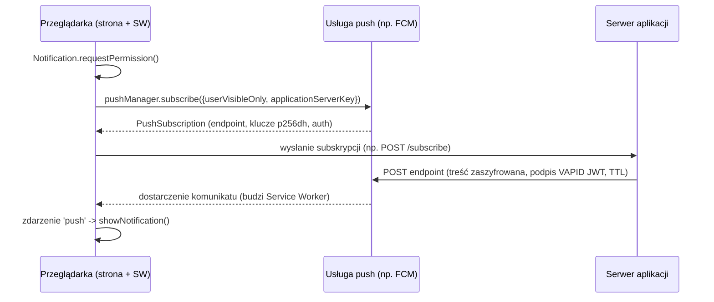

---
tags:
  - obrona
up: "[[Mapa zagadnień]]"
zagadnienie: 10
---
# 10. Technologie HTML5: WebWorker, WebStorage, Service Worker, Web Push
---
> HTML5 to nie tylko znaczniki, ale też zestaw **Web API**, które zmieniają przeglądarkę w platformę aplikacyjną. Pozwalają one na przetwarzanie wielowątkowe, trwałe składowanie danych po stronie klienta, pracę offline i otrzymywanie powiadomień od serwera.

Lista API: [[Technologie internetowe w przetwarzaniu rozproszonym/HTML 5#Web APIs]].

## Web Workers
**Cel**: wykonywanie JavaScriptu **w tle, w osobnym wątku**, bez blokowania wątku interfejsu (JS w przeglądarce jest domyślnie jednowątkowy – pętla zdarzeń).

### Rodzaje
- **Dedykowany** (`Worker`) – należy do jednego skryptu/strony.
- **Współdzielony** (`SharedWorker`) – współdzielony przez wiele okien/kart tego samego pochodzenia; komunikacja przez porty.
- **Service Worker** – specjalny rodzaj workera (niżej).

### Komunikacja
```js
// main.js
const w = new Worker('worker.js');
w.postMessage({ n: 40 });                 // wysłanie
w.onmessage = e => console.log(e.data);   // odbiór
w.onerror = e => console.error(e.message);
w.terminate();                             // zakończenie z zewnątrz

// worker.js
self.onmessage = e => {
  const r = fib(e.data.n);                 // ciężkie obliczenia
  self.postMessage(r);
};
importScripts('lib.js');                   // ładowanie skryptów
```
- Dane przekazywane przez **kopiowanie** (_structured clone_) albo **przeniesienie własności** (_transferable objects_, np. `ArrayBuffer` – bez kopiowania).
- **Ograniczenia**: brak dostępu do DOM, `window`, `document`; dostępne `XMLHttpRequest`/`fetch`, `WebSocket`, timery, IndexedDB; ta sama polityka pochodzenia.
- Zastosowania: przetwarzanie obrazów, kryptografia, parsowanie dużych danych, obliczenia.

## Web Storage
Składowanie par **klucz → wartość (łańcuchy)** po stronie klienta, powiązane z **pochodzeniem** (_origin_). Następca ciasteczek do przechowywania danych: nie jest wysyłany z każdym żądaniem HTTP i ma większą pojemność (typowo ~5 MiB na pochodzenie).

| | `localStorage` | `sessionStorage` |
|---|---|---|
| Trwałość | bezterminowo (do usunięcia) | do zamknięcia karty/okna |
| Zasięg | wszystkie okna/karty danego pochodzenia | jedna karta (sesja przeglądania) |
| Zdarzenie `storage` | tak (w innych oknach) | nie między kartami |

```js
localStorage.setItem('theme', 'dark');
localStorage.getItem('theme');           // 'dark'
localStorage.removeItem('theme');
localStorage.clear();
localStorage.key(0); localStorage.length;
localStorage.user = JSON.stringify(obj); // tylko stringi -> JSON

window.addEventListener('storage', e =>
  console.log(e.key, e.oldValue, e.newValue, e.url));
```
- API **synchroniczne** (może blokować przy dużych danych), brak transakcji i indeksów.
- **Bezpieczeństwo**: dostępne dla każdego skryptu strony → podatne na XSS; nie przechowywać tokenów sesyjnych/sekretów ([[29 Podatności webowe - XSS, SQLi, CSRF]]).
- **IndexedDB** – asynchroniczna, transakcyjna baza obiektowa (object stores, indeksy, kursory); dostępna też w workerach. **Web SQL** – przestarzałe.

## Service Worker
**Skrypt działający w tle**, niezależnie od otwartych stron. Pełni rolę **programowalnego pośrednika sieciowego** (proxy) między aplikacją webową a siecią. Podstawa **Progressive Web Apps** (PWA).

### Właściwości
- sterowany zdarzeniami, przeglądarka może go w każdej chwili zatrzymać i ponownie uruchomić (brak stanu w zmiennych globalnych),
- brak dostępu do DOM; komunikacja ze stronami przez `postMessage`,
- wymaga **HTTPS** (wyjątek: `localhost`) – przechwytuje ruch, więc musi być zaufany,
- działa w obrębie **zakresu** (_scope_), np. `/app/`.

### Cykl życia
```js
// strona
navigator.serviceWorker.register('/sw.js', { scope: '/' });

// sw.js
self.addEventListener('install', e => {          // 1. instalacja: precache
  e.waitUntil(caches.open('v1').then(c =>
    c.addAll(['/', '/app.js', '/style.css'])));
});
self.addEventListener('activate', e => {         // 2. aktywacja: sprzątanie starych cache
  e.waitUntil(caches.keys().then(keys =>
    Promise.all(keys.filter(k => k !== 'v1').map(k => caches.delete(k)))));
});
self.addEventListener('fetch', e => {            // 3. przechwytywanie żądań
  e.respondWith(caches.match(e.request)
    .then(r => r || fetch(e.request)));          // cache-first
});
```
1. **Rejestracja** → pobranie skryptu.
2. **install** – przygotowanie (np. zapisanie zasobów w Cache API).
3. **waiting** – nowa wersja czeka, aż zamkną się strony kontrolowane przez starą (`self.skipWaiting()` przyspiesza).
4. **activate** – czyszczenie starych wersji; `clients.claim()` przejmuje otwarte strony.
5. **idle / fetch / push / sync / message** – obsługa zdarzeń; zakończenie przez przeglądarkę, gdy bezczynny.

### Strategie cache
- **cache first** (zasoby statyczne), **network first** (dane aktualne, fallback do cache offline),
- **stale-while-revalidate** (odpowiedź z cache + odświeżenie w tle), **cache only**, **network only**.

### Inne możliwości
**Background Sync** (odłożenie wysyłki do odzyskania połączenia), **Push** (niżej), Periodic Background Sync, pre-caching aktualizacji.

## Web Push (powiadomienia push)
Pozwala **serwerowi aplikacji** wysłać komunikat do przeglądarki **nawet gdy strona jest zamknięta**. Składa się z:
- **Push API** – subskrypcja i odbiór komunikatów przez Service Worker,
- **Notifications API** – wyświetlenie powiadomienia systemowego,
- **Web Push Protocol** (RFC 8030) – komunikacja serwera z **usługą push** przeglądarki (np. FCM dla Chrome, Mozilla Autopush),
- **szyfrowanie treści** (RFC 8291) i **VAPID** (RFC 8292) – identyfikacja serwera aplikacji kluczem publicznym.

### Przebieg

```js
// strona
const reg = await navigator.serviceWorker.ready;
const sub = await reg.pushManager.subscribe({
  userVisibleOnly: true,                         // każdy push musi dać widoczne powiadomienie
  applicationServerKey: VAPID_PUBLIC_KEY });
await fetch('/subscribe', { method: 'POST', body: JSON.stringify(sub) });

// sw.js
self.addEventListener('push', e => {
  const data = e.data.json();
  e.waitUntil(self.registration.showNotification(data.title, {
    body: data.body, icon: '/icon.png', data: { url: data.url } }));
});
self.addEventListener('notificationclick', e => {
  e.notification.close();
  e.waitUntil(clients.openWindow(e.notification.data.url));
});
```
- **Endpoint** – unikalny URL w usłudze push, identyfikuje subskrypcję (tajny).
- Usługa push **nie widzi treści** (szyfrowanie end-to-end kluczami `p256dh`/`auth`).
- Parametry: `TTL` (jak długo przechowywać, gdy urządzenie offline), `Urgency`, `Topic` (zastępowanie wcześniejszych).
- Wygaśnięcie subskrypcji → serwer dostaje 404/410 i usuwa ją.

## Porównanie
| API | Wątek | Czas życia | Główne zastosowanie |
|---|---|---|---|
| Web Worker | osobny, na stronę | ze stroną | obliczenia w tle |
| Shared Worker | osobny, wiele stron | dopóki są strony | współdzielony stan/połączenie |
| Service Worker | osobny, niezależny | zarządzany przez przeglądarkę | offline, proxy, push, sync |
| Web Storage | wątek główny (synchr.) | trwały / sesja | proste dane klucz-wartość |
| Web Push | przez Service Worker | subskrypcja | powiadomienia inicjowane przez serwer |
