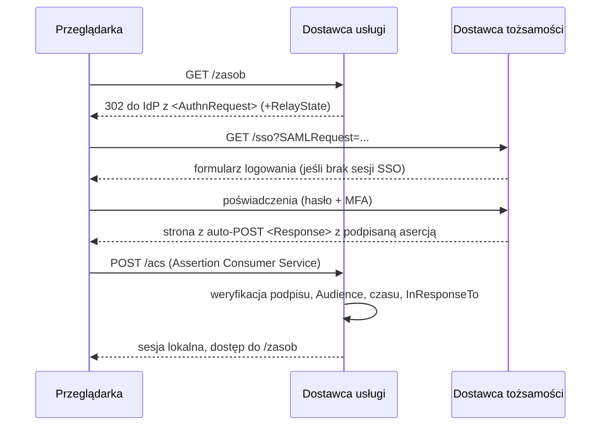

---
tags:
  - obrona
up: "[[Mapa zagadnień]]"
zagadnienie: 26
---
# 26. Jednokrotne uwierzytelnianie (SSO) – zasada działania, zastosowania, zalety i wady
---
> **SSO** (_Single Sign-On_) – użytkownik **uwierzytelnia się raz** u zaufanego **dostawcy tożsamości**, a następnie korzysta z **wielu niezależnych usług/aplikacji** bez ponownego podawania poświadczeń. Usługi ufają potwierdzeniu (biletowi, asercji, tokenowi) wystawionemu przez dostawcę tożsamości.

## Zasada działania
### Role
- **Użytkownik** (podmiot, _principal_) i jego **agent** (przeglądarka, klient Kerberos).
- **Dostawca tożsamości – IdP** (_Identity Provider_): uwierzytelnia użytkownika (hasło, MFA) i wystawia **potwierdzenie tożsamości**; np. KDC Kerberosa, Keycloak, Microsoft Entra ID, Okta, CAS, Shibboleth IdP.
- **Dostawca usługi – SP / RP** (_Service Provider_ / _Relying Party_): aplikacja, która **nie przetwarza hasła**, lecz weryfikuje potwierdzenie od IdP.

### Idea
1. Użytkownik próbuje wejść do usługi A (SP).
2. SP nie zna użytkownika → przekierowuje go do IdP.
3. IdP uwierzytelnia użytkownika i tworzy **sesję SSO u IdP** (ciasteczko / TGT).
4. IdP wystawia **potwierdzenie** (asercję/token/bilet) **podpisane** lub zaszyfrowane kluczem zaufanym przez SP.
5. SP weryfikuje potwierdzenie (podpis, odbiorca, czas ważności, nonce) i tworzy **lokalną sesję**.
6. Przy wejściu do usługi B: przekierowanie do IdP → **sesja SSO już istnieje** → IdP od razu wystawia potwierdzenie bez pytania o hasło.

**Zaufanie** konfigurowane z góry: wymiana metadanych i certyfikatów (SAML), rejestracja klienta (OIDC), wspólne klucze (Kerberos).

## Realizacje
### Kerberos (SSO w domenie / sieci korporacyjnej)
- Logowanie do stacji → **TGT** w pamięci podręcznej biletów.
- Dostęp do usług (udziały SMB, poczta, HTTP z **SPNEGO/Negotiate**, SSH GSSAPI, LDAP) → automatyczne pobranie **biletu usługi** z TGS.
- Szczegóły protokołu: [[25 Mechanizmy egzekwowania polityki uwierzytelniania#6. Kerberos (MIT, v5 – RFC 4120)]].
- Typowo w **Active Directory** (Windows Integrated Authentication), FreeIPA; w Linuksie SSSD/Winbind ([[Zarządzanie Systemami Komputerowymi/Winbind]]).

### SAML 2.0 (OASIS, 2005) – webowe SSO i federacja
**Asercja SAML** – dokument XML podpisany przez IdP: `<Issuer>`, `<Subject>` (NameID), `<Conditions>` (NotBefore/NotOnOrAfter, `AudienceRestriction`), `<AuthnStatement>` (kiedy i jak uwierzytelniono), `<AttributeStatement>` (atrybuty: e-mail, grupy).

**Przepływ SP-initiated (Web Browser SSO, wiązania HTTP-Redirect / HTTP-POST)**:

- **IdP-initiated** – użytkownik zaczyna w portalu IdP (mniej bezpieczne – brak powiązania z żądaniem).
- **Federacja** – wiele organizacji ufa sobie przez metadane (np. eduGAIN, PIONIER.Id dla uczelni).
- **Single Logout (SLO)** – `LogoutRequest` propagowany do SP.

### OpenID Connect (OIDC) – na OAuth 2.0
Przepływ **Authorization Code + PKCE**:
1. RP przekierowuje przeglądarkę do `/authorize?response_type=code&client_id=…&redirect_uri=…&scope=openid profile&state=…&nonce=…&code_challenge=…`.
2. Użytkownik loguje się u OP (IdP), który zwraca `redirect_uri?code=…&state=…`.
3. RP wymienia **kod** na tokeny na zapleczu (`POST /token` z `code_verifier`, uwierzytelnieniem klienta).
4. Otrzymuje **ID Token** (JWT: `iss`, `sub`, `aud`, `exp`, `iat`, `nonce`, `auth_time`, `amr`) – dowód uwierzytelnienia; oraz **access token** (dostęp do API) i opcjonalnie refresh token.
5. RP weryfikuje podpis ID Tokena (klucze z `jwks_uri`), `aud`, `iss`, `exp`, `nonce`.
- JSON/REST zamiast XML → popularny w aplikacjach mobilnych, SPA, „Zaloguj przez Google”.
- **OAuth 2.0 sam w sobie nie jest protokołem uwierzytelniania** (access token nie mówi, kto jest zalogowany dla danego klienta) – dlatego OIDC.

### CAS (Central Authentication Service, Yale)
- Przeglądarka przekierowana do serwera CAS, po zalogowaniu CAS ustawia **TGC** (_Ticket Granting Cookie_) i przekierowuje z **ST** (_Service Ticket_, jednorazowy) do usługi.
- Usługa **weryfikuje ST bezpośrednio u CAS** (`/serviceValidate`) i otrzymuje login.
- Popularny na uczelniach (np. USOS/CAS).

### Inne formy
- **Enterprise SSO (ESSO)** – agent na stacji wypełnia hasła w starych aplikacjach (to raczej menedżer haseł).
- **Synchronizacja haseł** (to samo hasło w wielu systemach, np. przez LDAP) – **to nie jest SSO** (użytkownik loguje się wielokrotnie, każda aplikacja widzi hasło).
- **Uwierzytelnianie przez nagłówek od reverse proxy** (oauth2-proxy, Shibboleth SP) – proxy realizuje SSO, aplikacja ufa nagłówkom.
- **WS-Federation**, SAML w WS-Security ([[Technologie internetowe w przetwarzaniu rozproszonym/WS-Security]]).

## Zastosowania
- **korporacje**: jedno logowanie do stacji, poczty, intranetu, ERP, VPN (AD + Kerberos, Entra ID),
- **chmura / SaaS**: logowanie do Office 365, Google Workspace, Salesforce, AWS przez firmowy IdP (SAML/OIDC),
- **uczelnie i federacje naukowe**: eduroam (802.1X z RADIUS), eduGAIN (SAML), CAS,
- **konsumenckie**: „Zaloguj przez Google/Apple/Facebook” (OIDC),
- **mikroserwisy**: brama API weryfikuje token OIDC, usługi przekazują tożsamość (JWT),
- **Kubernetes, narzędzia DevOps**: logowanie OIDC do klastrów, GitLab, Grafana.

## Zalety
| Użytkownik | Organizacja / bezpieczeństwo |
|---|---|
| jedno logowanie, mniej haseł do zapamiętania | **centralna polityka** uwierzytelniania (MFA, siła haseł) w jednym miejscu |
| szybszy dostęp, lepsze UX | aplikacje **nie przechowują i nie widzą haseł** (mniejsza powierzchnia ataku) |
| mniej zmęczenia hasłami → mniej zapisywania haseł na kartkach i powtarzania | **szybkie odebranie dostępu** – zablokowanie konta w IdP odcina wszystkie usługi |
| | mniej zgłoszeń resetu haseł (niższe koszty helpdesku) |
| | **centralny audyt** logowań, łatwiejsza zgodność z regulacjami |
| | łatwa integracja nowych aplikacji i partnerów (federacja) |

## Wady i zagrożenia
- **Pojedynczy punkt awarii** – niedostępność IdP blokuje dostęp do **wszystkich** usług (konieczna wysoka dostępność, replikacja).
- **Pojedynczy punkt kompromitacji** – przejęte konto/sesja SSO daje dostęp do wszystkiego („klucz do królestwa”) → konieczne MFA, krótkie sesje, monitorowanie.
- **Kompromitacja IdP / kluczy podpisujących** – możliwość fałszowania asercji (Golden SAML, Golden Ticket).
- **Złożoność** wdrożenia i konfiguracji zaufania, różne protokoły dla różnych aplikacji, starsze aplikacje bez wsparcia.
- **Błędy implementacji po stronie SP**: brak weryfikacji podpisu, `Audience`, `InResponseTo`/`state`/`nonce`; ataki XML Signature Wrapping (SAML); otwarte przekierowania; kradzież tokenów.
- **Wylogowanie** – trudne globalne wylogowanie (SLO zawodne), sesje lokalne żyją dalej.
- **Prywatność** – IdP wie, z jakich usług korzysta użytkownik (śledzenie), korelacja identyfikatorów (łagodzone pseudonimowymi `NameID`/`sub` per usługa).
- **Uzależnienie od dostawcy** (vendor lock-in) przy chmurowych IdP.
- **Phishing** strony logowania IdP – jedna podrobiona strona dla wszystkich usług (łagodzone FIDO2).

## Porównanie protokołów
| | Kerberos | SAML 2.0 | OpenID Connect | CAS |
|---|---|---|---|---|
| Środowisko | sieć LAN, domena | web, federacja B2B | web, mobile, API | web (uczelnie) |
| Format potwierdzenia | bilet binarny (ASN.1), szyfr. symetryczne | asercja XML podpisana | JWT (JSON) podpisany | bilet (losowy ID) weryfikowany na serwerze |
| Transport | własny protokół (UDP/TCP 88) | przekierowania HTTP / POST | przekierowania + REST | przekierowania + weryfikacja back-channel |
| Kryptografia | symetryczna (KDC zna klucze) | asymetryczna (podpis IdP) | asymetryczna/HMAC | TLS do serwera CAS |
| Wymaga zegarów | tak (±5 min) | tak (Conditions) | tak (`exp`) | nie krytycznie |
