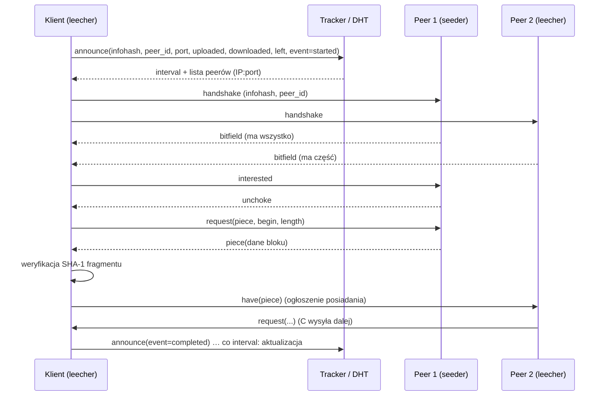

---
tags:
  - obrona
up: "[[Mapa zagadnień]]"
zagadnienie: 50
---
# 50. Protokół BitTorrent – zasada działania, przeznaczenie
---
> **BitTorrent** (Bram Cohen, 2001) to protokół P2P do **efektywnej dystrybucji dużych plików** do wielu odbiorców. Plik jest dzielony na **fragmenty**, a uczestnicy pobierają je **równolegle od wielu źródeł** i **jednocześnie udostępniają** fragmenty, które już mają. Dzięki temu **pojemność systemu rośnie z liczbą pobierających**. Mechanizm **wet za wet** (_tit-for-tat_) motywuje uczestników do wysyłania danych.

## Przeznaczenie
- **Rozpraszanie obciążenia** z pojedynczego serwera (koszt pasma) na odbiorców – szczególnie przy **nagłych szczytach** popularności (_flash crowd_).
- Zastosowania:
  - dystrybucje Linuksa (obrazy ISO), aktualizacje gier (Blizzard), dane naukowe (Academic Torrents),
  - Internet Archive, wdrażanie oprogramowania w centrach danych (Twitter „Murder”, Facebook – wcześniej), synchronizacja plików (Resilio Sync),
  - dystrybucja dużych modeli ML i zbiorów danych,
  - także (niestety) wymiana nielegalnych treści.
- **Nie jest systemem wyszukiwania** – plik `.torrent` lub link magnet trzeba pozyskać osobno (strony WWW, indeksy).
- W szczytowych latach (2004–2010) generował znaczną część ruchu w Internecie.

## Pojęcia
- **Torrent** – zbiór metadanych opisujący plik/pliki do pobrania.
- **Rój** (_swarm_) – wszyscy uczestnicy wymieniający dany torrent.
- **Seeder** (siewca) – ma **kompletny** plik i tylko wysyła.
- **Leecher** (pijawka) – pobiera (jednocześnie wysyła posiadane fragmenty); termin też na użytkowników, którzy nie wysyłają.
- **Peer** – dowolny uczestnik roju.
- **Tracker** – serwer koordynujący: zna uczestników roju.
- **Fragment** (_piece_) – jednostka weryfikacji integralności; **blok** (_block_, zwykle 16 KiB) – jednostka przesyłu w obrębie fragmentu.
- **Współczynnik udostępnienia** (_share ratio_) – wysłane / pobrane.

## Plik metainformacji (.torrent)
Kodowany w **bencode** (proste kodowanie: `i42e` liczby, `4:spam` napisy, `l...e` listy, `d...e` słowniki):
```
d
  8:announce   URL trackera (np. http://tracker.example.org:6969/announce)
  13:announce-list  lista zapasowych trackerów
  7:comment, 10:created by, 13:creation date
  4:info d
    4:name          nazwa pliku / katalogu
    12:piece length rozmiar fragmentu (potęga 2, typowo 256 KiB – 4 MiB)
    6:pieces        konkatenacja 20-bajtowych skrótów SHA-1 wszystkich fragmentów
    6:length        rozmiar (dla jednego pliku)
       lub 5:files  lista {length, path} (dla wielu plików – traktowane jak jeden ciąg bajtów)
    7:private       1 = tylko tracker, bez DHT/PEX (trackery prywatne)
  e
e
```
- **infohash** = $SHA\text{-}1(\text{bencode(info)})$ – **globalny identyfikator torrenta** (20 bajtów; BitTorrent v2 – SHA-256 i drzewa Merkle per plik).
- **Link magnet**: `magnet:?xt=urn:btih:<infohash>&dn=nazwa&tr=<tracker>` – zawiera tylko infohash; metadane (`info`) pobierane od peerów (rozszerzenie ut_metadata, BEP 9).

## Zasada działania


### 1. Tracker
- Protokół HTTP(S) `GET /announce?info_hash=…&peer_id=…&port=6881&uploaded=…&downloaded=…&left=…&event=started|completed|stopped&compact=1` lub **UDP tracker** (BEP 15 – mniejszy narzut).
- Odpowiedź (bencode): `interval` (co ile sekund ponawiać – zwykle 30 min), `complete`/`incomplete` (liczba seederów/leecherów), lista **peerów** (typowo **50** losowych; format kompaktowy – 6 bajtów na peer).
- Tracker **nie uczestniczy w przesyle danych** i nie zna zawartości.
- Endpoint `scrape` – statystyki roju.

### 2. Trackerless – DHT i PEX
- **Mainline DHT** (BEP 5) oparta na **Kademlii** ([[49 Ustrukturyzowane systemy P2P i DHT#Kademlia (Maymounkov, Mazières – NYU, IPTPS 2002)]]): węzły 160-bitowe, zapytania `ping`, `find_node`, **`get_peers(infohash)`** (zwraca peerów lub bliższe węzły + token), **`announce_peer(infohash, port, token)`**; miliony węzłów.
- **PEX** (_Peer Exchange_, BEP 11) – peery wymieniają listy znanych peerów.
- **LSD** (_Local Service Discovery_) – multicast w sieci lokalnej.

### 3. Protokół wymiany (_peer wire protocol_)
Połączenia **TCP** (lub **uTP** – BEP 29, transport na UDP z kontrolą przeciążenia LEDBAT, ustępującą innemu ruchowi).

**Handshake**: `<19>"BitTorrent protocol"<8 bajtów rozszerzeń><infohash 20B><peer_id 20B>`.

**Stan połączenia** (w każdą stronę): `am_choking`, `am_interested`, `peer_choking`, `peer_interested`; początkowo **zdławione** (_choked_) i **niezainteresowane**. Dane płyną tylko, gdy odbiorca jest **zainteresowany** i nadawca go **odblokował** (_unchoked_).

**Komunikaty** (`<długość><id><ładunek>`):
| id | Komunikat | Znaczenie |
|---|---|---|
| – | keep-alive | długość 0, co ~2 min |
| 0 | **choke** | nie będę ci wysyłać |
| 1 | **unchoke** | możesz żądać bloków |
| 2 | **interested** | chcę coś od ciebie |
| 3 | not interested | – |
| 4 | **have**(index) | ogłoszenie: mam fragment `index` (po weryfikacji) |
| 5 | **bitfield** | po handshake: mapa bitowa posiadanych fragmentów |
| 6 | **request**(index, begin, length) | żądanie bloku (typowo 16 KiB) |
| 7 | **piece**(index, begin, block) | dane bloku |
| 8 | cancel(index, begin, length) | anulowanie żądania (tryb końcowy) |
| 9 | port | port DHT |

- **Potokowanie żądań** (_pipelining_) – kilka `request` naraz (np. 5+) dla wydajności TCP.
- Po otrzymaniu wszystkich bloków fragmentu → **weryfikacja SHA-1**; niezgodny fragment odrzucany (ochrona przed błędami i zatruwaniem), peer wysyłający złe dane może zostać zablokowany.
- **Rozszerzenia** (BEP 10 – Extension Protocol): ut_metadata, ut_pex, szyfrowanie protokołu (MSE/PE – utrudnia wykrywanie przez operatorów).

## Algorytmy
### Wybór fragmentów (_piece selection_)
1. **Ścisły priorytet** (_strict priority_) – po zażądaniu jednego bloku fragmentu, żądaj najpierw **pozostałych bloków tego fragmentu** → szybko kompletne fragmenty, które można udostępniać.
2. **Najpierw najrzadsze** (_rarest first_) – pobieraj fragment, który ma **najmniej** znanych peerów (liczone z bitfield/have).
   - rzadkie fragmenty szybko się replikują → **równomierna dostępność** fragmentów w roju,
   - zapobiega **zniknięciu** fragmentów, gdy seeder odejdzie,
   - uczestnik ma fragmenty, których **inni potrzebują** (lepsza pozycja w wet za wet),
   - obciążenie seedera: pobierane od niego jest to, czego nie ma nikt inny.
3. **Losowy pierwszy fragment** (_random first piece_) – na początku klient **nic nie ma**, więc nie może wymieniać. Rzadki fragment pobierałby się wolno (mało źródeł), dlatego pierwszy (lub pierwsze kilka) wybiera się **losowo**, by jak najszybciej mieć coś do zaoferowania; potem rarest first.
4. **Tryb końcowy** (_endgame mode_) – gdy pozostały ostatnie bloki, a ich pobieranie z wolnego peera by się dłużyło: żądania brakujących bloków wysyłane do **wszystkich** peerów, a po otrzymaniu bloku do reszty idzie `cancel`. Eliminuje problem „ostatnich procentów”.

### Dławienie – wet za wet (_choking algorithm, tit-for-tat_)
Cel: nagradzać tych, którzy wysyłają; zniechęcać do pasożytowania (**free-riding**); efektywnie wykorzystać pasmo (TCP źle działa przy wielu jednoczesnych wysyłkach).
- Klient **odblokowuje** (unchoke) ograniczoną liczbę peerów – domyślnie **4**:
  - **3 regularne sloty** – peery, **od których najszybciej pobiera** (pomiar szybkości w kroczącym oknie ~20 s), spośród zainteresowanych,
  - **1 optymistyczny slot** (_optimistic unchoke_) – **losowy** peer, niezależnie od szybkości, zmieniany co **30 s**.
- Decyzje (re-choke) **co 10 s** – rzadziej niż czas stabilizacji TCP, by uniknąć „trzepotania”.
- **Optymistyczne odblokowanie**:
  - **odkrywanie** lepszych partnerów, niż obecni,
  - **start nowych uczestników** – bez niego nowy peer bez fragmentów nigdy nie dostałby danych (_bootstrapping_),
  - nowi peery mają zwykle **3× większą** szansę bycia wybranymi.
- **Anty-ignorowanie** (_anti-snubbing_): jeśli od peera nie przyszedł żaden blok przez **60 s**, uznaje się go za „ignorującego” (_snubbed_) i nie odblokowuje go poza optymistycznym slotem → częstsze optymistyczne odblokowania, szybsze znalezienie nowych partnerów.
- **Tryb seedera**: seeder nie pobiera, więc odblokowuje peery wg **szybkości wysyłania do nich** (lub rotacyjnie – nowsze klienty), by jak najszybciej rozprowadzić dane.

To gra typu **dilemma więźnia** powtarzanego – strategia wet za wet sprzyja współpracy.

## Własności i ocena
### Zalety
- **skalowalność** – im więcej pobierających, tym więcej źródeł (w przeciwieństwie do klient–serwer), obsługa flash crowd,
- **efektywne wykorzystanie pasma wysyłania** uczestników, niski koszt dla wydawcy,
- **integralność** – skróty fragmentów (SHA-1/SHA-256),
- **odporność** – pobieranie od wielu źródeł, wznawianie, brak SPoF (DHT),
- **motywacja do współpracy** (tit-for-tat).

### Wady i problemy
- plik musi mieć **seedery** – torrent „umiera”, gdy nie ma kompletnego zbioru fragmentów w roju,
- **brak wyszukiwania** w protokole, zależność od indeksów i trackerów (w wersji z trackerem – SPoF),
- **free-riding** nadal możliwy (pobieranie tylko od seederów, optymistyczne sloty); strategiczni klienci – **BitTyrant** (Piatek i in. 2007) wysyłają minimum potrzebne do bycia odblokowanym → wet za wet nie jest w pełni odporny,
- mało efektywny dla **małych plików** i niszowych treści,
- prywatność – adres IP widoczny dla roju (monitorowanie przez właścicieli praw),
- **ruch przeciwny operatorom** – dławienie (_traffic shaping_) BitTorrenta, a w odpowiedzi szyfrowanie; ruch między sieciami operatorów – **ISP-friendly** (lokalność peerów, P4P, ALTO),
- ataki: zatruwanie (fałszywe fragmenty – wykrywane skrótami, marnowane pasmo), eclipse na DHT, amplifikacja DDoS przez DHT/UDP.

## BitTorrent a inne podejścia
| | Klient–serwer (HTTP/FTP) | CDN | BitTorrent |
|---|---|---|---|
| Źródła pobrania | 1 serwer | serwery brzegowe dostawcy | wielu uczestników |
| Koszt pasma wydawcy | rośnie liniowo z liczbą pobrań | opłata dla CDN | minimalny |
| Skalowalność przy szczycie | słaba | dobra (kosztem) | rośnie z liczbą pobierających |
| Integralność | TLS/sumy ręcznie | TLS | skróty fragmentów w metadanych |
| Wymaga uczestników | nie | nie | tak (seedery) |

## Zobacz też
- [[48 Nieustrukturyzowane systemy P2P]], [[49 Ustrukturyzowane systemy P2P i DHT]]
- [[Algorytmy Rozproszone/Gossiping]] – PEX jako forma plotkowania
